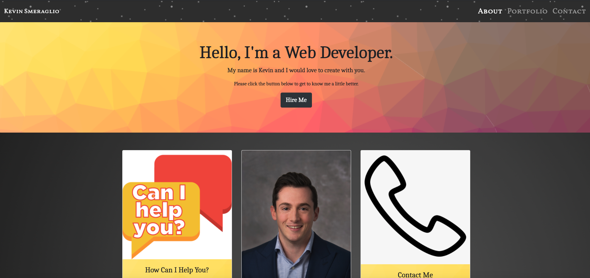
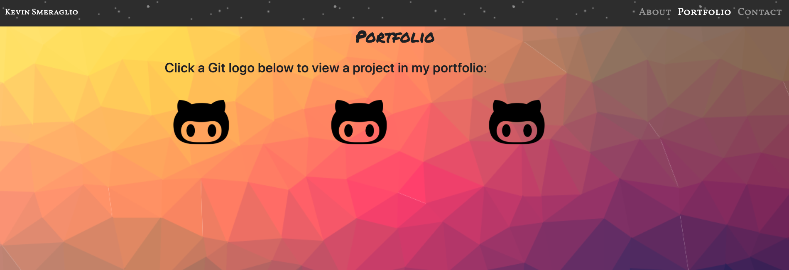
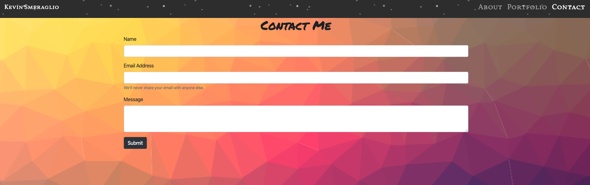

# My-Portfolio
1) Goals and Methods
- Using HTML, CSS, Bootstrap and Javascript, I have created a profile that my future employers can use to get a better look at my work! In this responsive profile, there is main information page, portfolio page and a contact me section. I hope employers can use this to get in contact with me and to ask me any questions that they have about my work on display. Enjoy!

2) Technologies
- HTML
- Bootstrap
- Google Fonts
- CSS
- FontAwesome
- JavaScript

3) Installation: 
- None necessary. Please view the link below:

Link: https://ksmera01.github.io/My-Portfolio/

Please view the screenshots below of the deployed application: 

